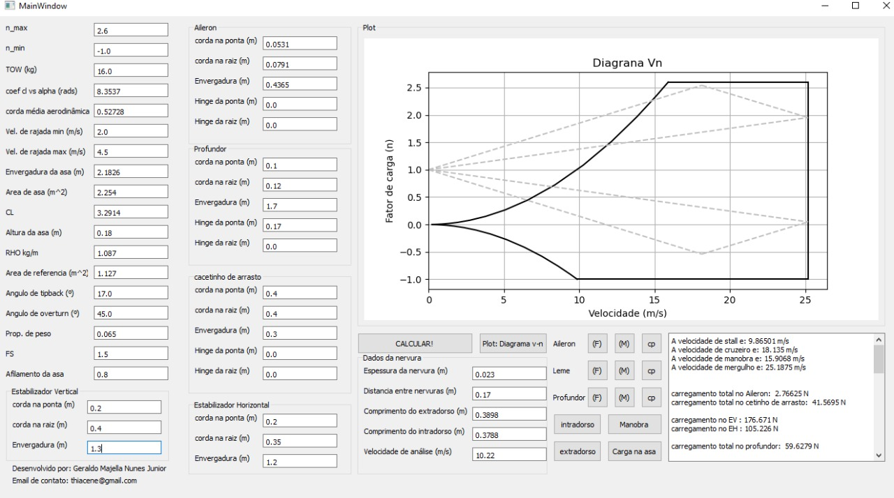

# LoadsCalc

O programa é baseado na norma FAR PART 23, onde é calculado os carregamentos nas asas, superfífices de controle e trem de pouso em dadas situações. O programa também calcula os  diagramas/evelopes de voo, estabelecendo os limites estruturais da aeronave.

O mesmo é recomendado para cálculos bem preliminares de projeto, pois o mesmo se baseia fundamentalmente na sustentação para dado TOW e dado fator de carga.

